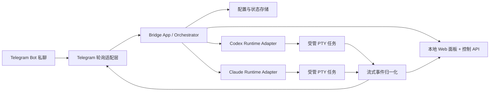

# cli2chatbot

把本地 `codex` 和 `claude` CLI 工作流桥接到 Telegram 私聊机器人，让你可以远程发任务、看流式进度、管理本地实例。

## 项目作用

`cli2chatbot` 是一个本地优先的控制桥。它把下面几层连起来：

- Telegram Bot 私聊
- 本地 `codex` CLI
- 本地 `claude` CLI
- 本地常驻 bridge daemon
- 本地监控面板

目标很直接：

- 在外面通过 Telegram 远程启动 Codex / Claude 实例
- 发任务给家里的 CLI
- 实时看到输出进度
- 在 CLI 卡住时远程停止、重置、强杀
- 在本机浏览器里查看实例和最近输出

## 当前 v1 范围

已经实现：

- 单用户 Telegram 私聊控制
- 本地批准式 owner 绑定
- 本地 daemon 模式
- `codex` / `claude` 逻辑实例池
- 基于 PTY 的任务执行
- Telegram 消息编辑式流式输出预览
- 本地 Web 面板
- 本地 HTTP 控制 API
- `~/.cli2chatbot` 下的配置和状态持久化

还没实现：

- 多用户支持
- Telegram 群组路由
- webhook 模式
- tmux 接管/附着模式
- 更强的 idle reaper / orphan 管理
- 对官方 Codex / Claude 原生会话的深度恢复
- 带认证的远程 Web 管理台

## 架构图



## 主要功能

- Telegram 私聊命令面控制 `codex` 和 `claude`
- 本地 bridge daemon 管理逻辑实例
- 用 Telegram 消息编辑回显流式输出
- daemon 感知的 CLI 命令
- 本地 Web 面板查看 daemon、实例和最新输出
- `doctor` 检查 Telegram、CLI、存储、PTY、端口可用性

## 环境要求

- Node.js 22+
- 已安装 `codex` CLI
- 已安装 `claude` CLI
- Telegram bot token

## 安装

```bash
pnpm install
pnpm build
npm link
```

说明：

- `npm link` 只需要执行一次，用来把本仓库的 `cli2chatbot` 命令注册到全局 PATH。
- 完成后可直接在任意目录运行 `cli2chatbot`。

## 快速开始

```bash
cli2chatbot init
cli2chatbot doctor
cli2chatbot
```

说明：

- `cli2chatbot`（不带子命令）默认等价于 `cli2chatbot serve`。

`serve` 启动后：

- Telegram 私聊机器人开始可用
- 本地面板默认在 `http://127.0.0.1:4567`
- 第一次给 bot 发私聊消息时，会在本地面板生成待授权请求

## CLI 命令

### `cli2chatbot init`

交互式初始化本地配置。

配置文件位置：

```text
~/.cli2chatbot/config.json
```

会询问：

- Telegram bot token
- 可选的预授权 Telegram user id
- 默认工作目录
- `codex` 可执行文件路径
- `claude` 可执行文件路径

### `cli2chatbot serve`

启动本地 bridge daemon。它负责：

- 轮询 Telegram 更新
- 管理 runtime 实例
- 启动 PTY 子任务
- 回传 Telegram 流式输出
- 提供本地 Web 面板和控制 API

### `cli2chatbot status`

查看当前 daemon 状态。如果 daemon 已经运行，这个命令会优先走本地 HTTP 控制 API，而不是重新构造一个“假的本地状态视图”。

### `cli2chatbot instances list`

列出当前已知的全部实例。

### `cli2chatbot instances start --runtime codex|claude`

创建一个新的逻辑实例，并把它设为当前选中实例。

### `cli2chatbot instances stop <instanceId>`

停止该实例当前正在运行的任务。

### `cli2chatbot instances reset <instanceId>`

清空该实例在 bridge 层维护的上下文/转录内容，并恢复为 idle。

### `cli2chatbot instances kill <instanceId>`

强杀该实例当前活动子进程，并把实例标记为 killed。

### `cli2chatbot doctor`

执行本地诊断，包括：

- Telegram bot token 是否可用
- `codex --version`
- `claude --version`
- 状态目录是否可写
- `node-pty` 原生模块是否可加载
- 本地 Web 端口是否可用

## Telegram 命令

daemon 运行后，可以在 Telegram 私聊里发送：

```text
/help
/menu
/status
/instances
/current
/start_codex
/start_claude
/use <instanceId>
/cwd [path]
/args [codex|claude]
/setargs <runtime> <args...>
/clearargs <runtime>
/model [runtime] <model>
/restart
/ask <prompt>
/stop
/reset
/kill
/logs
/web
```

命令说明：

- `/start_codex` 和 `/start_claude`：创建新的逻辑实例
- `/menu`：显示 Telegram 按钮菜单（实例、模型、控制指令）
- `/use <instanceId>`：切换当前选中实例
- `/cwd`：查看当前实例工作目录；`/cwd <path>` 可切换到新目录
- 已选中实例后，也可以直接发送普通文本，不必一定使用 `/ask`
- `/model [runtime] <model>`：设置模型；省略 runtime 时默认作用于当前实例 runtime
- `/model default`：清除 `--model` 参数，回到 CLI 默认模型
- 流式输出通过反复编辑同一条 Telegram 消息来展示
- `/logs`：返回当前实例保存的转录快照
- `/web`：返回本地面板地址

## 本地 Web 面板

本地 Web 面板是运行这套 bridge 的那台机器上的监控界面。

默认地址：

```text
http://127.0.0.1:4567
```

当前会显示：

- daemon PID
- Telegram 最近连接时间与错误状态
- 实例总数
- 任务总数
- 已授权 Telegram 用户列表（含连接状态）
- 待授权 Telegram 请求
- 受管实例表
- 最近一次任务输出预览

适合用在这些场景：

- Telegram 输出被截断时
- 想在本机快速看实例状态时
- 想确认 daemon 是否还活着时

当前它还不是：

- 完整可交互的远程管理台
- 带认证的公网 dashboard
- 多用户控制台

## 本地 HTTP 控制 API

daemon 会暴露一个仅本机使用的 HTTP API，CLI 在 `serve` 已运行时会复用它。

主要接口：

- `GET /api/status`
- `GET /api/auth/pending`
- `GET /api/auth/allowed`
- `POST /api/auth/approve/:userId`
- `POST /api/auth/revoke/:userId`
- `GET /api/instances`
- `POST /api/instances`
- `POST /api/instances/:instanceId/use`
- `POST /api/instances/:instanceId/stop`
- `POST /api/instances/:instanceId/reset`
- `POST /api/instances/:instanceId/kill`
- `GET /api/instances/:instanceId/logs`

它的定位是本地协调接口，不是公网远程接口。

## 状态与文件

运行数据默认存储在：

```text
~/.cli2chatbot/
```

关键文件：

- `config.json`：用户配置
- `state.json`：daemon / 实例 / 任务状态
- `events.log`：追加式事件日志

## stop / reset / kill 的区别

三者语义不同：

- `stop`：中断当前任务，但保留实例
- `reset`：清空逻辑上下文/转录，实例回到 idle
- `kill`：直接终止活动子进程，并把实例标记为 killed

当前 v1 的实现说明：

- `reset` 目前是 bridge 层的逻辑重置
- 还不是对 Codex / Claude 官方原生会话的深度重置

## 安全模型

v1 的安全边界是故意收窄的：

- 只支持 Telegram 私聊
- 首次私聊会进入待授权队列，需在本机面板批准
- 批准后只有 owner 的 Telegram user id 能发命令
- Web 面板默认只监听 loopback
- 没有公网 Web 认证
- 不支持群聊
- 不做多用户角色系统

这适合“单用户、本地优先”的使用方式，但还不能算面向公网的强化部署方案。

## 开发

构建：

```bash
pnpm build
```

测试：

```bash
pnpm test
```

直接运行：

```bash
pnpm dev serve
```

## 当前状态

目前仓库状态：

- 基础实现已经搭起来
- `build` 已通过
- 测试已通过
- 还需要用你的真实 Telegram token 和本机 CLI 做端到端联调

## 补充文档

如果要继续提高下一轮开发命中率，先看这两份：

- [技术设计与实施手册](./docs/%E6%8A%80%E6%9C%AF%E8%AE%BE%E8%AE%A1%E4%B8%8E%E5%AE%9E%E6%96%BD%E6%89%8B%E5%86%8C.md)
- [参考项目拆解](./docs/%E5%8F%82%E8%80%83%E9%A1%B9%E7%9B%AE%E6%8B%86%E8%A7%A3.md)

## 备注

- v1 只支持单个 owner 的 Telegram 私聊控制，但首次绑定不再要求手填 `user id`。
- 首次私聊 bot 时会生成待授权请求，需要在本机 Web 面板里点击批准。
- Web 面板默认监听 `127.0.0.1`。
- `reset` 目前清的是 bridge 逻辑上下文，不是官方 CLI 深层会话状态。
